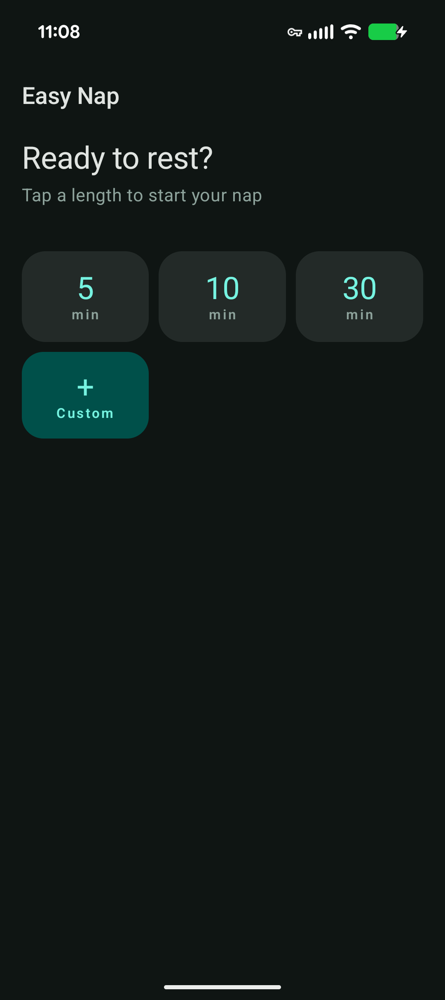
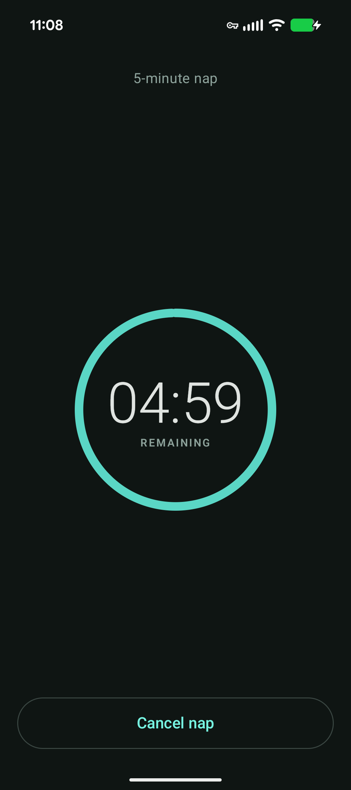
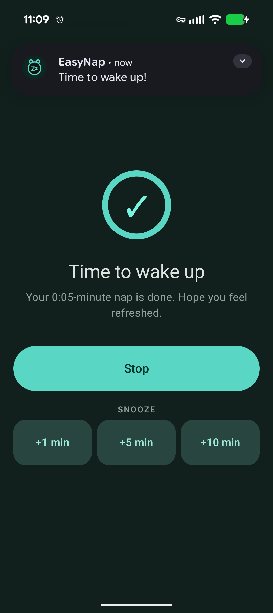
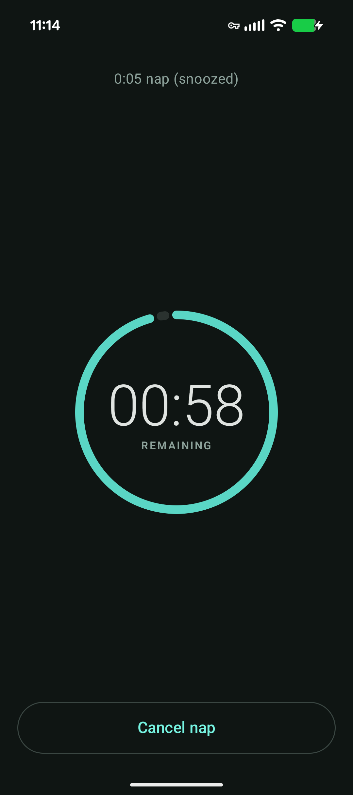

# EasyNap

> *The nap, at its simplest.*

EasyNap is a single-purpose nap timer. Pick a duration, start it, and get woken by a gentle alarm — even if your phone locks, the screen turns off, or you leave the app.

  &nbsp;
  

| Main screen | Conuntdown | Alarm | Snoozing |
|--|--|--|--|
|  |  |    |  |

## Features

- **Custom or quick-start duration** — type any number of minutes, or tap a quick-start button from 5 to 60 minutes.
- **Persistent countdown** — a foreground service keeps the timer running when the app is closed or backgrounded.
- **Reliable completion** — fires on time even when the device is idle or the screen is off.
- **Gentle alarm** — vibration first, then a slowly rising tone over the lock screen, fading out after 45 seconds.
- **Resume in place** — open the app while a timer is running and you land on the live countdown with a Cancel button.

## Specs

This project is specified with [OpenSpec](https://github.com/Fission-AI/OpenSpec). Behavior, architecture, and implementation details live under `openspec/`.
